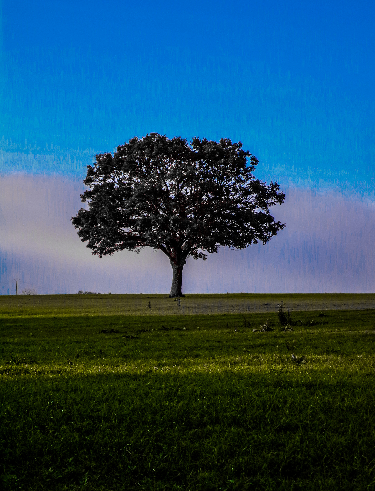

<!DOCTYPE html>
<html lang="fr">
<head>
<meta charset="UTF-8">
<title>Site Web 2.0 – Bonne année 2026</title>

</head>

<body>

<h1>🎆 Bonne année 2026 🎆</h1>

<!-- Boutons liens -->

    <button onclick="openUrl('https://www.youtube.com/@FuzeIII')">YouTube Fuze</button>
    <button onclick="openUrl('https://www.youtube.com/results?search_query=ksp+fr')">KSP FR</button>
    <button onclick="openUrl('https://www.youtube.com')">Accueil YouTube</button>
    <button onclick="openUrl('https://meteofrance.com')">Météo France</button>
    <button onclick="openUrl('https://discord.com')">Discord</button>
    <button onclick="openUrl('https://steamcommunity.com')">Steam</button>

<!-- Boutons image -->

    <button onclick="showImage()">Afficher l'image</button>
    <button onclick="hideImage()">Cacher l'image</button>

<!-- Image -->

    

</body>
</html>

